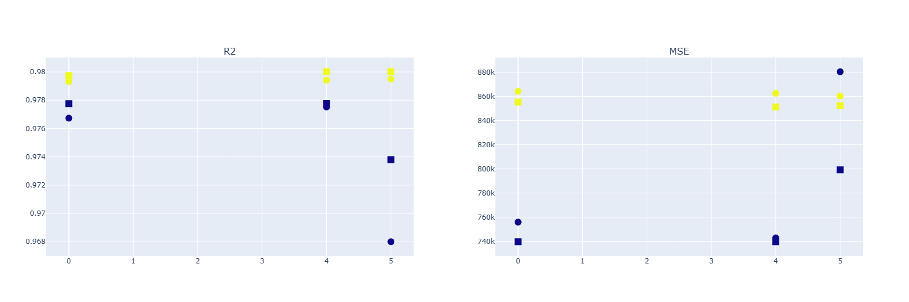
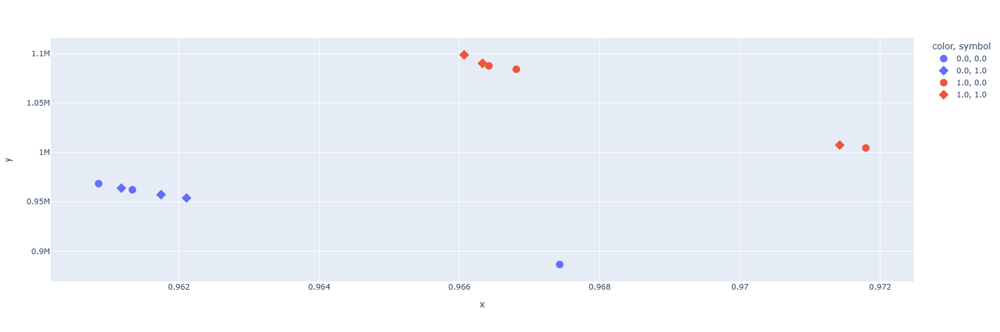

# IRONHACK_Kaggle competition

<div style="text-align:center">
    
</div>

## Indice:
1.[📜 Descripción](#descripcion)\
2.[⏳ Desarrollo](#desarrollo)\
3.[🔬 Conclusiones](#conclusiones)\
4.[📁 Estructura](#Estructura)

## Descripción:<a name="descripcion"/>

Sexto proyecto en Ironhack, donde se participará en una competición de kaggle, y tendrá como participantes a todos los alumnos del bootcamp. 

La [competición](https://www.kaggle.com/competitions/predict-the-price-for-laptops) consistirá en la predicción del precio de ordenadores personales, a partir de una serie de características.

Para ello usaremos herramientas de Machine Learning, por lo que tendremos que limpiar y transformar los datos para lograr el objetivo.

## Desarrollo:<a name="desarrollo"/>

Realizaremos el proceso siguiendo los siguientes pasos:

1- En el notebook [EDA](https://github.com/gusavato/IRONHACK_Kaggle_competition/blob/main/jupyter/1%20-%20EDA.ipynb) partimos de los datos proporcionados por la competición, limpiaremos y prepararemos los datos para poder aplicar las transformaciones pertinentes de cara a entrenar un modelo de Machine Learning.

2- En el notebook [Transformación](https://github.com/gusavato/IRONHACK_Kaggle_competition/blob/main/jupyter/2%20-%20Transformacion.ipynb) continuaremos con el proceso iniciado en el paso anterior, y normalizaremos y etiquetaremos distintas características para poder aplicar el modelo que consideremos más adecuado. Aparte realizaremos un proceso de clusterización mediante K-Means con el objetivo de enriquecer los datos

3- En el último notebook [Creación del modelo y entrenamiento](https://github.com/gusavato/IRONHACK_Kaggle_competition/blob/main/jupyter/3%20-%20Creaci%C3%B3n%20del%20modelo%20y%20entrenamiento%20.ipynb) aplicaremos modelos de Random Forest y seleccionaremos los parámetros óptimos mediante [RandomizeSearchCV](https://scikit-learn.org/stable/modules/generated/sklearn.model_selection.RandomizedSearchCV.html).

Aparte alimentaremos el modelo con distintas combinaciones de características para intentar conseguir una predicción más ajustada. Las combinaciones usadas son las siguientes:
- Teniendo en cuenta o no los outliers
- Etiquetando los clusters obtenidos en el apartado anterior
- Eliminando o no columnas con alta correlación

## Conclusiones:<a name="conclusiones"/>

Tras realizar 24 predicciones obtenemos las siguientes conclusiones:
- El modelo de Random Forest ha obtenido valores de R2 elevados (por encima de 0.95)
- El error cuadrático obtenido es casi 10 veces menor que la desviación estándar (6306430) de los datos proporcionados
- El haber hecho una clusterización no mejora signficativamente el modelo
- Si tenemos en cuenta los outliers (color amarillo) vemos un R2 más elevado pero también mayor MSE
- Si tenemos en cuenta las columnas con alta colinealidad, obtenemos mejores valores de R2 y menores de MSE

<div style="text-align:center">
    
</div>

Tras subir las predicciones se ve que el error cuadrático medio es 3 veces mayor al obtenido en el entrenamiento. Lo que nos indica que el modelo tiene un elevado grado de "overfit" como ya se había predicho.

Por ello seleccionamos modelos de RandomizedSearchCV que hayan obtenido una calificación intermedia de todas las iteraciones.

- Obtenemos valores similares de R2 y valores algo superiores de MSE, seguramente esto haga que los datos de test no salgan tan distintos
- Vemos de nuevo que la presencia de outliers hace que no tengamos el R2 más elevado pero sí, valores más controlados de MSE

<div style="text-align:center">
    
</div>

## Estructura:<a name="Estructura"/>

```
root 
|__ data/               # Contiene todos los csv usados en el repositorio            
|   |__ clean/          # Datos ya limpios
|   |__ muestras/       # Predicciones obtenidas
|   |__ raw/            # Datos originales de la competición
|   |__ transform/      # Datos ya transformados para aplicar modelo de ML
|
|__ images/             # Contiene la imágenes que se han usado en el proyecto   
|
|__ jupyter/            # Alberga los notebooks usados en el proyecto
|
|__ .gitignore          # Archivo gitignore     
|
|__ README.md           # Descripción del proyecto